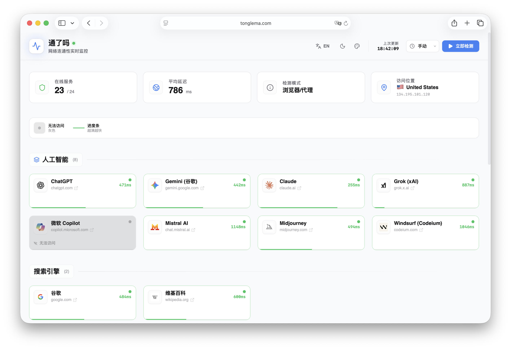
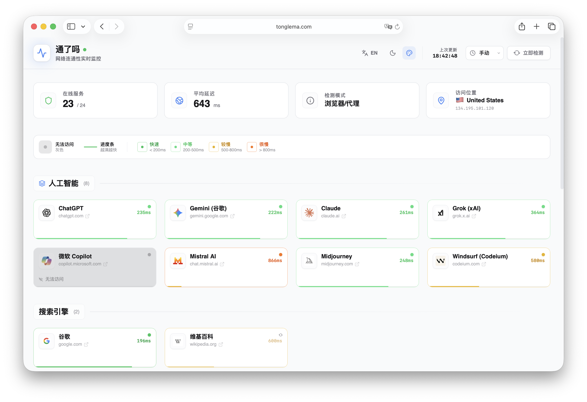
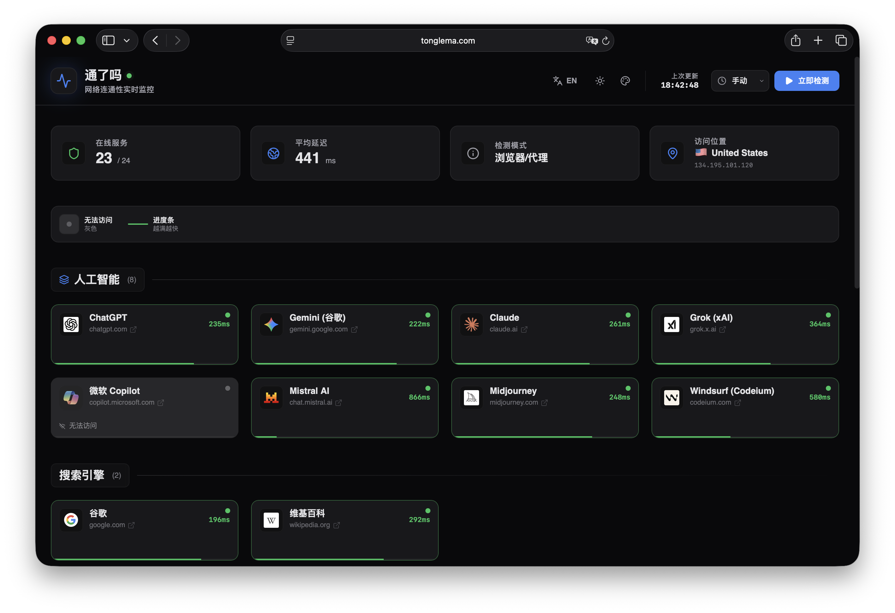
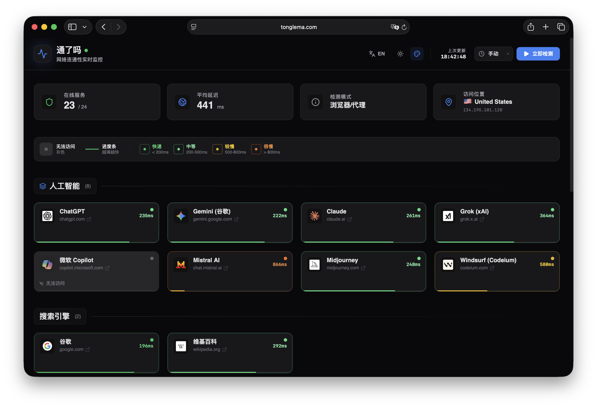

[English](README.en.md) | **中文**

# TongLeMa

<div align="center">
  
</div>

**TongLeMa** (通了吗) 是一个开源的网络连通性检测仪表板，帮助用户快速实时检测多个热门全球服务的延迟和连通状态。

🌐 **在线访问**: [TongLeMa.com](https://tonglema.com)

## 界面预览

### 亮色主题

<table>
<tr>
<td width="50%">

</td>
<td width="50%">

</td>
</tr>
</table>

### 暗色主题

<table>
<tr>
<td width="50%">

</td>
<td width="50%">

</td>
</tr>
</table>

## 功能特性

* **实时连通性检测**：一键检测多个热门服务的连通性和延迟。
* **可视化仪表板**：美观的网格状态卡片，带有颜色编码的延迟指示器，便于快速视觉评估。
* **位置检测**：自动检测您的网络位置（国家/城市）并以国旗 emoji 显示。
* **双语支持**：完整支持英文和中文（简体中文），可无缝切换语言。
* **暗色/亮色主题**：现代化的 UI，支持暗色和亮色主题，遵循系统偏好设置。
* **自动刷新**：可配置的自动刷新间隔，保持状态实时更新。
* **隐私优先**：使用 Fetch API 在浏览器中 100% 运行。不收集任何用户数据，也不会向任何后端服务器发送数据。
* **分类组织**：按服务类别（AI、搜索引擎、社交媒体、流媒体、开发工具）组织，便于导航。
* **详细统计**：显示在线服务数量、平均延迟和网络模式信息。

## 技术栈

* **React 19** - UI 框架
* **TypeScript** - 类型安全
* **Vite** - 构建工具和开发服务器
* **Tailwind CSS** - 实用优先的 CSS 框架
* **Framer Motion** - 动画库
* **Lucide React** - 图标库

## 快速部署

[](https://vercel.com/new/clone?repository-url=https://github.com/simonxmau/tonglema)

[](https://app.netlify.com/start/deploy?repository=https://github.com/simonxmau/tonglema)

[](https://heroku.com/deploy?template=https://github.com/simonxmau/tonglema)

[](https://console.aws.amazon.com/amplify/home#/deploy?repo=https://github.com/simonxmau/tonglema)

## 安装

### 开发环境

1. 克隆仓库：
   ```bash
   git clone https://github.com/simonxmau/tonglema.git
   cd tonglema
   ```

2. 安装依赖：
   ```bash
   npm install
   ```

3. 运行开发服务器：
   ```bash
   npm run dev
   ```

4. 在浏览器中打开 `http://localhost:5173`（或终端显示的端口）

### 生产构建

1. 构建项目：
   ```bash
   npm run build
   ```

2. 预览生产构建：
   ```bash
   npm run preview
   ```

构建后的文件将位于 `dist` 目录，可部署到任何静态托管服务（Vercel、Netlify、GitHub Pages 等）。

### Docker 构建

项目提供了 Docker 支持，可以快速构建和运行容器化版本：

1. **构建 Docker 镜像**：
   ```bash
   docker build -t tonglema .
   ```

2. **运行容器**：
   ```bash
   docker run -d -p 8080:80 --name tonglema tonglema
   ```

3. **访问应用**：
   在浏览器中打开 `http://localhost:8080`

4. **停止容器**：
   ```bash
   docker stop tonglema
   docker rm tonglema
   ```

Docker 镜像使用多阶段构建，最终基于 nginx 提供静态文件服务，体积小且性能优异。

### Docker Compose（推荐）

使用 Docker Compose 可以更便捷地管理容器：

1. **构建并启动服务**：
   ```bash
   docker compose up -d
   ```

2. **查看服务状态**：
   ```bash
   docker compose ps
   ```

3. **查看日志**：
   ```bash
   docker compose logs -f
   ```

4. **停止服务**：
   ```bash
   docker compose down
   ```

5. **重新构建并启动**：
   ```bash
   docker compose up -d --build
   ```

6. **访问应用**：
   在浏览器中打开 `http://localhost:8080`

Docker Compose 配置包含了健康检查、自动重启等特性，更适合生产环境使用。

## 在线访问

您也可以直接访问在线版本，无需安装：

🌐 [TongLeMa.com](https://tonglema.com) - 立即体验

🚀 [Vercel 部署版本](https://tonglema-com.vercel.app/) - Vercel 镜像

## Star 历史

[](https://www.star-history.com/#simonxmau/tonglema&type=date&legend=top-left)


## 开发与贡献

欢迎贡献和建议！您可以通过以下方式参与：

* Fork 本项目
* 提交 Issue
* 创建 Pull Request
* 建议新功能或改进

## 许可证

MIT

## 关于

TongLeMa (通了吗) - "连接了吗？" - 一个实时网络连通性监控工具，帮助您一目了然地检查热门全球服务的状态。

---

⭐ 如果您觉得这个项目有用，请考虑在 GitHub 上给它一个 Star！
